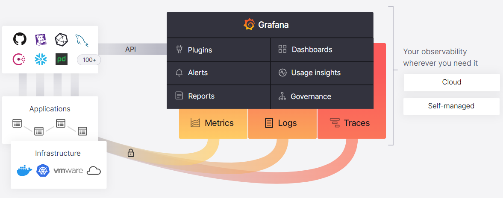

# Grafana

Grafana is a multi-platform open source analytics and interactive visualization web application. It provides charts, graphs, and alerts for the web when connected to supported data sources.

Grafana version

+ Open source
Centralize the analysis, visualization, and alerting for all of your data with Grafana. For users who prefer to set up, administer, and maintain their own installation.
  - Grafana open source software enables you to query, visualize, alert on, and explore your metrics, logs, and traces wherever they are stored. Grafana OSS provides you with tools to turn your time-series database (TSDB) data into insightful graphs and visualizations.
  - After you have installed Grafana and set up your first dashboard using instructions in Getting started with Grafana, you will have many options to choose from depending on your requirements.

+ Enterprise
Grafana’s powerful visualization and alerting, enhanced with access to Enterprise data source plugins and built-in collaboration features. For organizations that have specific privacy or security requirements and need a self-managed environment.
  - Grafana Enterprise is a commercial edition of Grafana that includes additional features not found in the open source version.
  - Building on everything you already know and love about Grafana open source, Grafana Enterprise includes exclusive datasource plugins and additional features.

+ Cloud
Offered as a fully managed service, Grafana Cloud is the fastest way to adopt Grafana and includes a scalable, managed backend for metrics, logs, and traces. Managed and administered by Grafana Labs with free and paid options for individuals, teams, and large enterprises. Includes a robust free tier with access to 10k metrics, 50GB logs, 50GB traces, and 500 VUh of k6 testing for 3 users.

## Grafana

### Startup

### [Dashboards](https://grafana.com/docs/grafana/latest/dashboards/?pg=hp&plcmt=lt-box-dashboards)

### [Plugins](https://grafana.com/docs/grafana/latest/administration/plugin-management/?pg=hp&plcmt=lt-box-plugins)

### [Alerts](https://grafana.com/docs/grafana/latest/alerting/?pg=hp&plcmt=lt-box-alerts)

### [Usage insights](https://grafana.com/docs/grafana/latest/dashboards/assess-dashboard-usage)

### [Reports](https://grafana.com/docs/grafana/latest/dashboards/share-dashboards-panels/?pg=hp&plcmt=lt-box-reports)

### [Governance](https://grafana.com/docs/grafana/latest/administration/?pg=hp&plcmt=lt-box-governance)

## 文獻

+ [Grafana](https://grafana.com/)
    - [Grafana Document](https://grafana.com/docs/grafana/latest/)
    - [Grafana Docker image](https://grafana.com/docs/grafana/latest/setup-grafana/installation/docker/)
+ Grafana Ecosystem
    - [Agent](https://grafana.com/docs/agent/latest/)
        + [Visualization and monitoring solutions](https://grafana.com/solutions/?plcmt=nav-solutions-cta1)
        + [Configuring the Grafana agent](https://www.scaleway.com/en/docs/observability/cockpit/api-cli/configuring-grafana-agent/)
    - [Loki](https://grafana.com/docs/loki/latest/?pg=hp&plcmt=lt-box-logs), a log aggregation platform based on Prometheus.
    - [Tempo](https://grafana.com/docs/tempo/latest/), a metric visualization tool released.
    - [Mimir](https://grafana.com/docs/mimir/latest/), a tool for log tracing.
+ [Introduction to Grafana | What is Grafana | Grafana Features](https://www.fosstechnix.com/introduction-to-grafana-what-is-grafana/)
